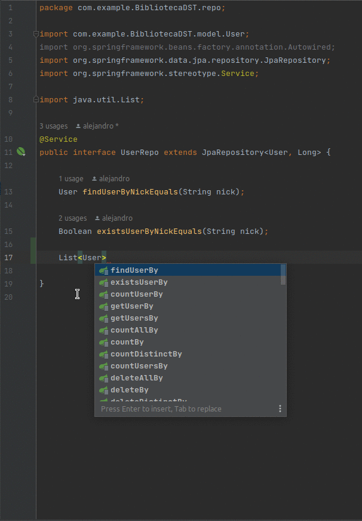

<h1 align="center">Aplicación Backend-End del Catálogo Digital de la Librería de DST</h1>


## Tabla de contenidos:

---

- [Descripción y contexto](#descripción-y-contexto)
- [Funcionalidades de la Aplicación](#funcionalidades-de-la-aplicación)
- [Guía de instalación](#guía-de-instalación)
- [Conclusión del Desarrollo](#conclusión)
- [Autor/es](#autores)

## Descripción y contexto

---

Al igual que la mayoría de aplicaciones web, se ha separado la lógica de la aplicación dós de dos entidades aisladas entre sí (Front-End y Back-End), que enfrentadas la una con la otra implementa el funcionamiento normal de la aplicación web. Para el desarrollo Back-End de la aplicación, se sigue una arquitectura web del tipo API REST, apolladas sobre repositorios y entidades JPA del modelo haciendo uso de uno de los principales frameworks de desarrollo Back-End de Java `Spring Boot`.


Spring Data JPA, parte de la gran familia Spring Data, facilita la implementación de repositorios basados en JPA. Este módulo trata del soporte mejorado para las capas de acceso a datos basadas en JPA. Facilita la creación de aplicaciones basadas en Spring que utilicen tecnologías de acceso a datos.

Implementar una capa de acceso a datos de una aplicación ha sido engorroso durante bastante tiempo. Siempre ha habido que escribir demasiado código repetitivo para ejecutar consultas sencillas y realizar paginación y auditoría. Spring Data JPA pretende mejorar significativamente la implementación de capas de acceso a datos reduciendo el esfuerzo a la cantidad realmente necesaria. Como desarrollador, usted escribe las interfaces de su repositorio, incluidos los métodos de búsqueda personalizados, y Spring proporcionará la implementación automáticamente.


Además de lo anterior JPA permite, mediante el uso de notaciones, definir el esquema de la base de datos directamente en las clases Java del modelo de la aplicación. Lo cual nos libera aún más a la hora de trabajar, ya que nos evita tener que lidiar con la implementación de la base de datos manualmente mediante scripts SQL. Otro detalle importante en la implementación del proyecto, ha sido la facilidad con la que se accede y manipulan datos a través de JPA, ya que, el propio framework nos permite definir consultas tradicionales SQl a través de métodos de java, en los que la lógica de la consulta queda definida simplemente en la especificación del método:

Por ejemplo si quisiéramos ofrecer un método en el API para consultar los usuarios cuyo nick contenga algún patrón específico basta con lo siguiente:

   

Mientras que de la forma tradicional en una consulta SQL quedaría de la siguiente forma: 

``` {SQL}
    SELECT * 
    FROM users
    WHERE users.nick LIKE patern;
```

Finalmente, un último punto importante en el desarrollo de cualquier aplicación de backend, es configurar el arranque de la aplicación de tal forma que esta admita las peticiones lanzadas desde la aplicación de Front-End que "manipula" el usuario. En este caso se ha habilitado un único end-point (la aplicación angular), las cabeceras y métodos HTTP interpretables por la aplicación:

```
    @Bean
	public CorsFilter corsFilter() {
		CorsConfiguration corsConfiguration = new CorsConfiguration();
		corsConfiguration.setAllowCredentials(true);
		corsConfiguration.setAllowedOrigins(Arrays.asList("http://localhost:4200"));
		corsConfiguration.setAllowedHeaders(Arrays.asList("Origin", "Access-Control-Allow-Origin", "Content-Type",
				"Accept", "Authorization", "Origin, Accept", "X-Requested-With",
				"Access-Control-Request-Method", "Access-Control-Request-Headers"));
		corsConfiguration.setExposedHeaders(Arrays.asList("Origin", "Content-Type", "Accept", "Authorization",
				"Access-Control-Allow-Origin", "Access-Control-Allow-Origin", "Access-Control-Allow-Credentials"));
		corsConfiguration.setAllowedMethods(Arrays.asList("GET", "POST", "PUT", "DELETE", "OPTIONS"));
		UrlBasedCorsConfigurationSource urlBasedCorsConfigurationSource = new UrlBasedCorsConfigurationSource();
		urlBasedCorsConfigurationSource.registerCorsConfiguration("/**", corsConfiguration);
		return new CorsFilter(urlBasedCorsConfigurationSource);
	}
```

## Funcionalidades de la Aplicación

---

* Implementación de métodos CRUD para entidades JPA
* Generación dinámica de consultas a partir de nombres de métodos de consulta
* Configuración de las políticas CORS para la interactuación de la aplicación con el Front-End
* Activación transparente de JPA NamedQueries por métodos de consulta
* Conexión con la base de datos MySQL
* Implementación de clases base de dominio que proporcionan propiedades básicas
* Posibilidad de integrar código de repositorio personalizado


## Guía de instalación

---

En casos normales, el primer paso antes de ejecutar la aplicación sería acudir a `https://start.spring.io` configurar manualmente las dependencias y descargar el esqueleto del proyecto, aunque las clases y componentes de la aplicación ya están hechos es suficiente con clonar el repositorio actual.

Para este caso en particular las dependencias de la aplicación se gestionan a través de Maven con lo que para arrancar la aplicación basta con ejecutar el siguiente comando dentro del directorio raíz del proyecto:

``` sh{background = true}
./mvn spring-boot:run
```

Con esto debería ser suficiente para iniciar la aplicación sin problemas, aunque siempre es preferible hacer uso de algún IDE que se encargue de la configuración del entorno par evitar posibles incompatibilidades.

## Conclusión

---

Spring Boot y JPA han proporcionado una gran facilidad en la configuración y desarrollo del backend, proporcionando una gran cantidad de herramientas para facilitar el desarrollo. Además, hemos utilizado una arquitectura REST para testear el API usando PostMan, lo que ha permitido una fácil integración con el frontend y una buena escalabilidad del proyecto. En conclusión, el uso de estas tecnologías ha permitido un desarrollo rápido y eficiente del proyecto y ha proporcionado una gran funcionalidad al mismo.

## Autor

---

[Alejandro Téllez Montiel](https://github.com/Alejandro405/bibliotecaDSTApp)           
Ale.t@uma.es   
Alejandro405
